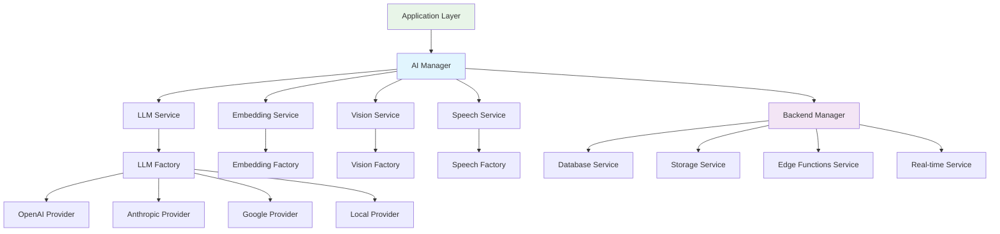

# TrustStream v4.2.1 Abstraction Layer Architecture Analysis for AI Integration

## Executive Summary

This analysis examines the existing abstraction layer architecture in TrustStream v4.2.1, identifying comprehensive opportunities for AI enhancement integration while maintaining complete backend portability. The current architecture demonstrates a sophisticated multi-layered abstraction system that can seamlessly accommodate AI service integration through well-defined patterns and interfaces.

**Key Findings:**
- Robust abstraction framework with 5 core service layers (Database, Auth, Storage, RealTime, Edge Functions)
- Comprehensive dependency injection system enabling AI service registration
- Backend-agnostic design patterns that naturally support AI provider switching
- Multiple integration points for AI enhancement without breaking existing functionality
- Performance optimization framework ready for AI workload integration

## 1. Current Abstraction Interface Architecture

### 1.1 Core Abstraction Layers

The TrustStream v4.2.1 architecture implements a comprehensive 5-layer abstraction system:

#### Database Abstraction Layer (`src/abstractions/database/`)
- **Interface**: `IDatabaseService` with unified CRUD operations
- **Providers**: Supabase, PostgreSQL, MongoDB, Firebase, Mock implementations
- **Features**: Transaction support, query building, connection pooling, health monitoring
- **Backend Switching**: Zero-downtime provider switching with data migration capabilities

```typescript
interface IDatabaseService {
  connect(config: DatabaseConfig): Promise<void>;
  create<T>(table: string, data: Partial<T>): Promise<T>;
  read<T>(table: string, query?: QueryOptions): Promise<T[]>;
  transaction<T>(operations: TransactionOperation[]): Promise<T>;
  // Additional methods for comprehensive database operations
}
```

#### Authentication Abstraction Layer (`src/abstractions/auth/`)
- **Interface**: `IAuthService` with comprehensive user management
- **Providers**: Supabase Auth, Firebase Auth, Auth0, Custom implementations
- **Features**: MFA, social auth, role management, session handling, security events
- **Extensibility**: Plugin architecture for new auth providers

```typescript
interface IAuthService {
  signUp(credentials: SignUpCredentials): Promise<AuthResult>;
  getCurrentUser(): Promise<User | null>;
  hasPermission(userId: string, resource: string, action: string): Promise<boolean>;
  // Additional auth operations
}
```

#### Storage Abstraction Layer (`src/abstractions/storage/`)
- **Interface**: `IStorageService` for file operations
- **Providers**: Supabase Storage, AWS S3, Google Cloud, Azure Blob, Filesystem
- **Features**: File upload/download, metadata management, signed URLs, versioning
- **AI Integration Ready**: Perfect for AI model storage, training data, embeddings

```typescript
interface IStorageService {
  upload(path: string, file: File | Buffer, options?: UploadOptions): Promise<UploadResult>;
  download(path: string): Promise<ArrayBuffer>;
  getSignedUrl(path: string, options: SignedUrlOptions): Promise<string>;
  // Additional storage operations
}
```

#### Edge Functions Abstraction Layer (`src/abstractions/edge-functions/`)
- **Interface**: `IEdgeFunctionProvider` for serverless compute
- **Providers**: Supabase Edge Functions, Vercel, Cloudflare Workers, AWS Lambda
- **Features**: Function deployment, execution monitoring, scaling, runtime support
- **AI Processing**: Ideal for AI inference, model serving, real-time AI processing

```typescript
interface IEdgeFunctionProvider {
  deployFunction(func: EdgeFunction): Promise<string>;
  invokeFunction(name: string, invocation: EdgeFunctionInvocation): Promise<EdgeFunctionResponse>;
  getMetrics(name: string, timeRange?: { start: Date; end: Date }): Promise<any>;
}
```

#### Real-Time Abstraction Layer (`src/abstractions/realtime/`)
- **Interface**: `IRealtimeService` for live communications
- **Providers**: Supabase Realtime, Firebase Realtime, Socket.io, WebSocket
- **Features**: Live subscriptions, presence tracking, channel management
- **AI Streaming**: Perfect for AI response streaming, real-time AI interactions

### 1.2 Backend Manager Architecture

The `BackendManager` class serves as the central orchestrator:

```typescript
class BackendManager {
  // Service access with unified interfaces
  getDatabaseService(): UnifiedDatabaseService
  getAuthService(): UnifiedAuthService
  getStorageService(): UnifiedStorageService
  getRealTimeService(): UnifiedRealTimeService
  getEdgeFunctionService(): UnifiedEdgeFunctionService
  
  // Backend switching capabilities
  switchProvider(targetProvider: string, options: BackendSwitchOptions): Promise<void>
  testProvider(providerName: string): Promise<BackendHealthStatus>
}
```

## 2. Backend-Agnostic Design Patterns

### 2.1 Provider Factory Pattern

Each service layer implements a factory pattern for provider instantiation:

```typescript
interface DatabaseProviderFactory {
  create(config: DatabaseConfig): IDatabaseProvider;
  validateConfig(config: DatabaseConfig): { valid: boolean; errors: string[] };
  getCapabilities(): DatabaseProviderCapabilities;
}
```

**AI Integration Opportunity**: This pattern can be extended to support AI service providers:

```typescript
interface AIProviderFactory {
  create(config: AIConfig): IAIProvider;
  validateConfig(config: AIConfig): { valid: boolean; errors: string[] };
  getCapabilities(): AIProviderCapabilities;
}
```

### 2.2 Dependency Injection Framework

The service container (`src/shared-utils/service-container.ts`) provides comprehensive IoC:

```typescript
class ServiceContainer implements IServiceContainer {
  register<T>(token: ServiceToken<T>, factory: ServiceFactory<T>, scope?: ServiceScope): void;
  resolve<T>(token: ServiceToken<T>): T;
  // Lifecycle management, scoping, dependency resolution
}
```

**AI Integration**: AI services can be registered and injected seamlessly:

```typescript
// Register AI services
container.registerSingleton(AI_TOKENS.LLM_SERVICE, () => new UnifiedLLMService());
container.registerSingleton(AI_TOKENS.EMBEDDING_SERVICE, () => new UnifiedEmbeddingService());
container.registerSingleton(AI_TOKENS.VISION_SERVICE, () => new UnifiedVisionService());

// Inject in agents or services
@Inject(AI_TOKENS.LLM_SERVICE)
private llmService: ILLMService;
```

### 2.3 Configuration-Driven Architecture

Backend selection is entirely configuration-driven:

```typescript
interface BackendConfiguration {
  version: string;
  activeProvider: string;
  providers: Record<string, BackendProvider>;
  migration?: MigrationConfig;
  monitoring?: MonitoringConfig;
}
```

## 3. Service-Specific Abstraction Analysis

### 3.1 Edge Functions Abstraction for AI Processing

**Current Capabilities:**
- Multi-runtime support (Deno, Node.js, Python, Go)
- Function deployment and management
- Execution monitoring and metrics
- Automatic scaling

**AI Integration Opportunities:**
1. **AI Model Inference Functions**: Deploy AI models as edge functions for real-time inference
2. **Prompt Processing**: Edge functions for prompt preprocessing and postprocessing
3. **AI Pipeline Orchestration**: Chain AI operations across multiple edge functions
4. **Model Serving**: Scalable AI model serving with automatic load balancing

```typescript
// AI-enhanced edge function example
const aiInferenceFunction: EdgeFunction = {
  name: 'ai-text-analysis',
  runtime: 'python',
  code: `
    import openai
    def handler(request):
      # AI processing logic
      return ai_response
  `,
  triggers: [{ type: 'http', config: { path: '/api/ai/analyze' }}],
  environment: { AI_MODEL_ENDPOINT: 'provider-specific-endpoint' }
};
```

### 3.2 Database Abstraction for AI Data Management

**Current Capabilities:**
- Vector database support through PostgreSQL extensions
- JSON querying for flexible AI data structures
- Transaction support for data consistency
- Real-time subscriptions for live AI updates

**AI Integration Opportunities:**
1. **Vector Storage**: Store and query AI embeddings across different vector databases
2. **Training Data Management**: Manage AI training datasets with versioning
3. **Model Metadata**: Store AI model configurations and performance metrics
4. **AI Audit Trails**: Track AI decision-making processes and outcomes

```typescript
// AI-enhanced database interface
interface IAIDatabaseService extends IDatabaseService {
  storeEmbedding(id: string, vector: number[], metadata: any): Promise<void>;
  searchSimilar(query: number[], limit: number, threshold?: number): Promise<SimilarityResult[]>;
  storeModelMetadata(modelId: string, metadata: ModelMetadata): Promise<void>;
  getModelPerformance(modelId: string, timeRange?: TimeRange): Promise<PerformanceMetrics>;
}
```

### 3.3 Authentication Abstraction for AI Security

**Current Capabilities:**
- Role-based access control (RBAC)
- Multi-factor authentication
- Session management
- Security event tracking

**AI Integration Opportunities:**
1. **AI Permission Management**: Control access to specific AI models and features
2. **AI Usage Tracking**: Monitor and limit AI service usage per user/role
3. **AI Audit Compliance**: Track AI usage for compliance and governance
4. **Personalized AI**: User-specific AI model preferences and history

### 3.4 Storage Abstraction for AI Assets

**Current Capabilities:**
- Multi-provider file storage
- Metadata management
- Versioning support
- Signed URL generation

**AI Integration Opportunities:**
1. **Model Storage**: Store AI models across different cloud providers
2. **Training Data**: Manage large training datasets with efficient access
3. **AI Artifacts**: Store AI-generated content with provenance tracking
4. **Model Versioning**: Version control for AI models and configurations

## 4. AI Enhancement Integration Points

### 4.1 Unified AI Service Layer

**Proposed Architecture:**

```typescript
// Core AI service interfaces
interface ILLMService {
  generateText(prompt: string, options?: LLMOptions): Promise<LLMResponse>;
  streamText(prompt: string, options?: LLMOptions): AsyncIterableIterator<string>;
  analyzeText(text: string, analysisType: AnalysisType): Promise<AnalysisResult>;
}

interface IEmbeddingService {
  generateEmbedding(text: string): Promise<number[]>;
  generateBatchEmbeddings(texts: string[]): Promise<number[][]>;
  calculateSimilarity(embedding1: number[], embedding2: number[]): number;
}

interface IVisionService {
  analyzeImage(image: ArrayBuffer, analysisType: VisionAnalysisType): Promise<VisionResult>;
  generateImageDescription(image: ArrayBuffer): Promise<string>;
  extractText(image: ArrayBuffer): Promise<string>;
}
```

**Provider Implementations:**
- OpenAI Provider (`GPT-4`, `DALL-E`, `Whisper`)
- Anthropic Provider (`Claude`)
- Google Provider (`Gemini`, `PaLM`)
- Azure OpenAI Provider
- Local Model Provider (`Ollama`, `Hugging Face`)
- Custom Model Provider

### 4.2 AI-Enhanced Agent Architecture

**Current Agent System:**
The system includes AI leader agents for quality, efficiency, transparency, accountability, and innovation.

**Enhancement Opportunities:**

```typescript
// Enhanced base agent with AI capabilities
abstract class AIEnhancedAgent extends GovernanceAgent {
  @Inject(AI_TOKENS.LLM_SERVICE)
  protected llmService: ILLMService;
  
  @Inject(AI_TOKENS.EMBEDDING_SERVICE)
  protected embeddingService: IEmbeddingService;
  
  protected async enhanceWithAI<T>(
    content: T, 
    enhancementType: AIEnhancementType
  ): Promise<T> {
    // AI enhancement logic that works across providers
  }
}
```

### 4.3 AI Configuration Management

**Provider-Agnostic AI Configuration:**

```typescript
interface AIConfiguration {
  version: string;
  activeProviders: {
    llm: string;
    embedding: string;
    vision: string;
    speech: string;
  };
  providers: Record<string, AIProvider>;
  fallbackStrategy: FallbackStrategy;
  costOptimization: CostOptimizationConfig;
}

interface AIProvider {
  name: string;
  type: 'openai' | 'anthropic' | 'google' | 'azure' | 'local' | 'custom';
  enabled: boolean;
  priority: number;
  config: {
    apiKey?: string;
    endpoint?: string;
    models: ModelConfig[];
  };
  capabilities: AICapabilities;
  limits: AILimits;
}
```

### 4.4 AI Service Registry and Discovery

**Service Registration:**

```typescript
// AI service tokens
export const AI_TOKENS = {
  LLM_SERVICE: Symbol('ILLMService') as ServiceToken,
  EMBEDDING_SERVICE: Symbol('IEmbeddingService') as ServiceToken,
  VISION_SERVICE: Symbol('IVisionService') as ServiceToken,
  SPEECH_SERVICE: Symbol('ISpeechService') as ServiceToken,
  AI_ORCHESTRATOR: Symbol('IAIOrchestrator') as ServiceToken,
} as const;

// AI service factory
class AIServiceFactory {
  createLLMService(config: AIConfig): ILLMService {
    switch (config.type) {
      case 'openai': return new OpenAILLMService(config);
      case 'anthropic': return new AnthropicLLMService(config);
      case 'google': return new GoogleLLMService(config);
      case 'local': return new LocalLLMService(config);
      default: throw new Error(`Unsupported LLM provider: ${config.type}`);
    }
  }
}
```

## 5. Backend Portability Preservation

### 5.1 AI Provider Abstraction Strategy

**Key Principles:**
1. **Interface Standardization**: Common interfaces across all AI providers
2. **Configuration Isolation**: Provider-specific configuration separate from business logic
3. **Capability Negotiation**: Dynamic capability discovery and selection
4. **Graceful Degradation**: Fallback strategies when providers are unavailable

### 5.2 AI Migration Framework

**Provider Switching Support:**

```typescript
interface AIMigrationManager {
  createMigrationPlan(
    sourceProvider: AIProvider, 
    targetProvider: AIProvider
  ): Promise<AIMigrationPlan>;
  
  executeMigration(plan: AIMigrationPlan): Promise<AIMigrationResult>;
  
  validateProviderCompatibility(
    sourceProvider: string, 
    targetProvider: string
  ): Promise<CompatibilityReport>;
}
```

### 5.3 AI Performance Monitoring

**Provider-Agnostic Monitoring:**

```typescript
interface AIPerformanceMonitor {
  trackRequest(providerId: string, request: AIRequest): Promise<void>;
  trackResponse(providerId: string, response: AIResponse, duration: number): Promise<void>;
  getProviderMetrics(providerId: string, timeRange?: TimeRange): Promise<AIMetrics>;
  compareProviders(providerIds: string[], metrics: MetricType[]): Promise<ProviderComparison>;
}
```

## 6. Implementation Recommendations

### 6.1 Phase 1: Core AI Abstraction Layer

**Priority 1 Tasks:**
1. **Implement AI Service Interfaces**: Create `ILLMService`, `IEmbeddingService`, `IVisionService`
2. **Develop Provider Factories**: Build factory pattern for AI service creation
3. **Extend Service Container**: Register AI services in dependency injection framework
4. **Create AI Configuration**: Implement AI-specific configuration management

**Code Structure:**
```
src/abstractions/ai/
├── index.ts                     # Main AI abstraction exports
├── interfaces/
│   ├── ILLMService.ts          # LLM service interface
│   ├── IEmbeddingService.ts    # Embedding service interface
│   ├── IVisionService.ts       # Vision service interface
│   └── ISpeechService.ts       # Speech service interface
├── providers/
│   ├── OpenAIProvider.ts       # OpenAI implementation
│   ├── AnthropicProvider.ts    # Anthropic implementation
│   ├── GoogleProvider.ts       # Google implementation
│   └── LocalProvider.ts        # Local model implementation
├── config/
│   ├── AIConfiguration.ts      # AI configuration types
│   └── AIConfigTemplates.ts    # Pre-built configurations
└── UnifiedAIService.ts         # Unified AI service coordinator
```

### 6.2 Phase 2: AI-Enhanced Edge Functions

**Implementation Steps:**
1. **Extend Edge Function Interface**: Add AI-specific deployment options
2. **AI Function Templates**: Create templates for common AI operations
3. **Model Deployment**: Implement model deployment to edge functions
4. **Scaling Management**: Add AI-aware scaling policies

### 6.3 Phase 3: AI Data Management

**Database Enhancements:**
1. **Vector Database Support**: Extend database interface for vector operations
2. **AI Metadata Storage**: Implement AI-specific data models
3. **Training Data Management**: Create data pipeline abstractions
4. **Performance Optimization**: Implement AI-aware query optimization

### 6.4 Phase 4: AI Security and Governance

**Security Integration:**
1. **AI Permission System**: Extend RBAC for AI resource access
2. **Usage Monitoring**: Implement AI usage tracking and limits
3. **Audit Trails**: Add AI decision tracking and compliance
4. **Privacy Controls**: Implement data privacy for AI processing

## 7. Integration Architecture Diagram



## 8. Benefits of AI Integration

### 8.1 Enhanced Capabilities
- **Intelligent Content Generation**: AI-powered content creation across all services
- **Smart Analytics**: AI-driven insights and recommendations
- **Automated Quality Assurance**: AI-enhanced quality monitoring and improvement
- **Personalized Experiences**: AI-customized user interactions

### 8.2 Maintained Portability
- **Provider Flexibility**: Switch between AI providers without code changes
- **Cost Optimization**: Dynamic provider selection based on cost and performance
- **Risk Mitigation**: Fallback strategies and multi-provider support
- **Future-Proofing**: Easy integration of new AI providers and technologies

### 8.3 Operational Excellence
- **Unified Monitoring**: Single dashboard for all AI and backend services
- **Consistent APIs**: Standardized interfaces across all service types
- **Simplified Management**: Centralized configuration and deployment
- **Scalable Architecture**: Horizontal scaling for AI and traditional workloads

## 9. Conclusion

The TrustStream v4.2.1 abstraction layer architecture provides an excellent foundation for AI enhancement integration while maintaining complete backend portability. The existing patterns of provider abstraction, dependency injection, and configuration management can be seamlessly extended to support AI services.

The recommended phased approach ensures minimal disruption to existing functionality while adding powerful AI capabilities. The architecture's design principles of interface standardization, provider independence, and graceful degradation naturally extend to AI service integration.

By following the implementation recommendations, TrustStream can achieve a sophisticated AI-enhanced platform that maintains its core strength of backend portability while adding cutting-edge AI capabilities across all service layers.

The integration points identified provide multiple pathways for AI enhancement, from basic LLM integration to sophisticated multi-modal AI workflows, all while preserving the system's fundamental architecture principles and maintaining seamless backend provider switching capabilities.
