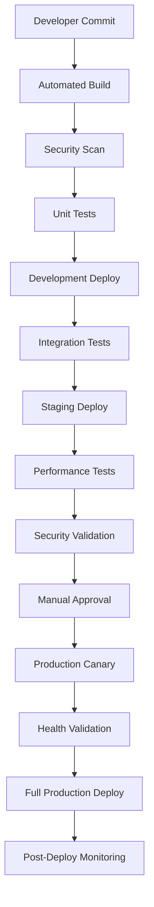

# Deployment Procedures Runbook

**ENTERPRISE-GRADE DEPLOYMENT PROTOCOLS**

## Overview

This runbook provides comprehensive deployment procedures for the Agentic Ecosystem, ensuring safe, reliable, and reversible deployments across all environments with zero-downtime objectives.

## Deployment Architecture

### Multi-Stage Pipeline Overview



### Environment Configuration

| Environment | Purpose | Auto-Deploy | Manual Approval | Traffic Allocation | Rollback Time |
|-------------|---------|-------------|-----------------|-------------------|---------------|
| **Development** | Feature Testing | ✅ | ❌ | N/A | Immediate |
| **Staging** | Pre-Production | ✅ | ❌ | 100% Test Traffic | < 2 minutes |
| **Production** | Live Service | ✅ | ✅ | Canary → Full | < 5 minutes |

## Pre-Deployment Validation

### Automated Quality Gates

```bash
#!/bin/bash
# Pre-deployment validation script

echo "=== PRE-DEPLOYMENT VALIDATION ==="
VALIDATION_PASSED=true

# 1. Code Quality Validation
echo "Checking code quality..."
npm run lint
if [ $? -ne 0 ]; then
  echo "❌ Linting failed"
  VALIDATION_PASSED=false
fi

# 2. Security Scan
echo "Running security scan..."
npm audit --audit-level high
if [ $? -ne 0 ]; then
  echo "❌ Security vulnerabilities detected"
  VALIDATION_PASSED=false
fi

# 3. Unit Tests
echo "Running unit tests..."
npm run test:unit
if [ $? -ne 0 ]; then
  echo "❌ Unit tests failed"
  VALIDATION_PASSED=false
fi

# 4. Build Validation
echo "Validating build process..."
npm run build
if [ $? -ne 0 ]; then
  echo "❌ Build failed"
  VALIDATION_PASSED=false
fi

# 5. Edge Function Validation
echo "Validating Edge Functions..."
supabase functions serve &
SERVE_PID=$!
sleep 5

# Test each function
for func in gdpr-compliance database-scalability production-monitoring error-tracking; do
  echo "Testing $func..."
  response=$(curl -s -X POST "http://localhost:54321/functions/v1/$func" \
    -H "Content-Type: application/json" \
    -d '{"action": "health_check"}' \
    -w "%{http_code}")
  
  if [[ "$response" != *"200"* ]]; then
    echo "❌ Function $func validation failed"
    VALIDATION_PASSED=false
  fi
done

kill $SERVE_PID

# Final validation result
if [ "$VALIDATION_PASSED" = true ]; then
  echo "✅ All pre-deployment validations passed"
  exit 0
else
  echo "❌ Pre-deployment validation failed"
  exit 1
fi
```

### Database Migration Validation

```sql
-- Pre-deployment database checks
-- Check 1: Verify no blocking locks
SELECT 
    blocked_locks.pid AS blocked_pid,
    blocked_activity.usename AS blocked_user,
    blocking_locks.pid AS blocking_pid,
    blocking_activity.usename AS blocking_user,
    blocked_activity.query AS blocked_statement,
    blocking_activity.query AS blocking_statement
FROM pg_catalog.pg_locks blocked_locks
JOIN pg_catalog.pg_stat_activity blocked_activity ON blocked_activity.pid = blocked_locks.pid
JOIN pg_catalog.pg_locks blocking_locks ON blocking_locks.locktype = blocked_locks.locktype
    AND blocking_locks.DATABASE IS NOT DISTINCT FROM blocked_locks.DATABASE
    AND blocking_locks.relation IS NOT DISTINCT FROM blocked_locks.relation
    AND blocking_locks.page IS NOT DISTINCT FROM blocked_locks.page
    AND blocking_locks.tuple IS NOT DISTINCT FROM blocked_locks.tuple
    AND blocking_locks.virtualxid IS NOT DISTINCT FROM blocked_locks.virtualxid
    AND blocking_locks.transactionid IS NOT DISTINCT FROM blocked_locks.transactionid
    AND blocking_locks.classid IS NOT DISTINCT FROM blocked_locks.classid
    AND blocking_locks.objid IS NOT DISTINCT FROM blocked_locks.objid
    AND blocking_locks.objsubid IS NOT DISTINCT FROM blocked_locks.objsubid
    AND blocking_locks.pid != blocked_locks.pid
JOIN pg_catalog.pg_stat_activity blocking_activity ON blocking_activity.pid = blocking_locks.pid
WHERE NOT blocked_locks.GRANTED;

-- Check 2: Verify table sizes for migration impact
SELECT 
    schemaname,
    tablename,
    pg_size_pretty(pg_total_relation_size(schemaname||'.'||tablename)) AS size,
    pg_total_relation_size(schemaname||'.'||tablename) AS size_bytes
FROM pg_tables 
WHERE schemaname = 'public'
ORDER BY size_bytes DESC;

-- Check 3: Verify constraint violations
SELECT conname, conrelid::regclass 
FROM pg_constraint 
WHERE contype = 'c' AND NOT convalidated;
```

## Environment-Specific Deployment

### Development Environment

```bash
#!/bin/bash
# Development deployment script

echo "=== DEVELOPMENT DEPLOYMENT ==="

# Set environment
export NODE_ENV=development
export SUPABASE_URL=$DEV_SUPABASE_URL
export SUPABASE_ANON_KEY=$DEV_SUPABASE_ANON_KEY

# Deploy Edge Functions
echo "Deploying Edge Functions to development..."
supabase functions deploy --project-ref $DEV_PROJECT_REF

# Deploy database migrations
echo "Applying database migrations..."
supabase db push --project-ref $DEV_PROJECT_REF

# Build and deploy frontend
echo "Building and deploying frontend..."
npm run build:dev
swa deploy ./dist --env development

# Post-deployment validation
echo "Running post-deployment tests..."
npm run test:integration:dev

echo "✅ Development deployment completed"
```

### Staging Environment

```bash
#!/bin/bash
# Staging deployment with comprehensive testing

echo "=== STAGING DEPLOYMENT ==="

# Environment setup
export NODE_ENV=staging
export SUPABASE_URL=$STAGING_SUPABASE_URL
export SUPABASE_ANON_KEY=$STAGING_SUPABASE_ANON_KEY

# Pre-deployment backup
echo "Creating pre-deployment backup..."
TIMESTAMP=$(date +%Y%m%d_%H%M%S)
supabase db dump --project-ref $STAGING_PROJECT_REF > "/tmp/staging-backup-${TIMESTAMP}.sql"

# Deploy with blue-green strategy
echo "Starting blue-green deployment..."

# Deploy to staging slot
echo "Deploying to staging slot..."
supabase functions deploy --project-ref $STAGING_PROJECT_REF
supabase db push --project-ref $STAGING_PROJECT_REF

# Build optimized assets
echo "Building optimized assets..."
npm run build:staging
swa deploy ./dist --env staging

# Comprehensive testing
echo "Running staging test suite..."
{
  # Performance tests
  npm run test:performance
  
  # Security tests
  npm run test:security
  
  # Integration tests
  npm run test:integration
  
  # Load tests
  npm run test:load
  
  # GDPR compliance tests
  npm run test:gdpr
  
} 2>&1 | tee "/tmp/staging-test-results-${TIMESTAMP}.log"

if [ ${PIPESTATUS[0]} -eq 0 ]; then
  echo "✅ Staging deployment and testing completed successfully"
  
  # Notify team of successful staging deployment
  curl -X POST $SLACK_WEBHOOK_URL \
    -H "Content-Type: application/json" \
    -d "{
      \"text\": \"✅ Staging deployment successful\",
      \"attachments\": [{
        \"color\": \"good\",
        \"fields\": [
          {\"title\": \"Environment\", \"value\": \"Staging\", \"short\": true},
          {\"title\": \"Timestamp\", \"value\": \"${TIMESTAMP}\", \"short\": true},
          {\"title\": \"Test Results\", \"value\": \"All tests passed\", \"short\": true}
        ]
      }]
    }"
else
  echo "❌ Staging deployment failed"
  # Rollback staging
  echo "Rolling back staging environment..."
  # Restore from backup if needed
  exit 1
fi
```

### Production Environment

```bash
#!/bin/bash
# Production deployment with canary strategy

echo "=== PRODUCTION DEPLOYMENT ==="

# Environment validation
if [ -z "$PROD_SUPABASE_URL" ] || [ -z "$PROD_SUPABASE_ANON_KEY" ]; then
  echo "❌ Production environment variables not set"
  exit 1
fi

# Set production environment
export NODE_ENV=production
export SUPABASE_URL=$PROD_SUPABASE_URL
export SUPABASE_ANON_KEY=$PROD_SUPABASE_ANON_KEY

TIMESTAMP=$(date +%Y%m%d_%H%M%S)
DEPLOYMENT_LOG="/tmp/production-deployment-${TIMESTAMP}.log"

{
  echo "Starting production deployment at $(date)"
  
  # Step 1: Pre-deployment health check
  echo "Performing pre-deployment health check..."
  curl -X POST https://etretluugvclmydzlfte.supabase.co/functions/v1/production-monitoring \
    -H "Content-Type: application/json" \
    -d '{"action": "system_status"}' \
    -w "Response Code: %{http_code}\n"
  
  if [ $? -ne 0 ]; then
    echo "❌ Pre-deployment health check failed"
    exit 1
  fi
  
  # Step 2: Create production backup
  echo "Creating production backup..."
  supabase db dump --project-ref $PROD_PROJECT_REF > "/tmp/prod-backup-${TIMESTAMP}.sql"
  
  # Upload backup to secure storage
  az storage blob upload \
    --account-name $AZURE_STORAGE_ACCOUNT \
    --container-name production-backups \
    --name "pre-deployment/backup-${TIMESTAMP}.sql" \
    --file "/tmp/prod-backup-${TIMESTAMP}.sql"
  
  # Step 3: Deploy database migrations (if any)
  echo "Checking for database migrations..."
  migration_diff=$(supabase db diff --project-ref $PROD_PROJECT_REF)
  if [ -n "$migration_diff" ]; then
    echo "Applying database migrations..."
    supabase db push --project-ref $PROD_PROJECT_REF
    
    # Verify migration success
    if [ $? -ne 0 ]; then
      echo "❌ Database migration failed"
      echo "Initiating rollback..."
      # Database rollback would be handled here
      exit 1
    fi
  fi
  
  # Step 4: Canary deployment - Deploy Edge Functions
  echo "Deploying Edge Functions (Canary Phase)..."
  supabase functions deploy --project-ref $PROD_PROJECT_REF
  
  # Step 5: Validate Edge Functions
  echo "Validating Edge Functions..."
  for func in gdpr-compliance database-scalability production-monitoring error-tracking; do
    echo "Testing $func..."
    response=$(curl -s -X POST "https://etretluugvclmydzlfte.supabase.co/functions/v1/$func" \
      -H "Content-Type: application/json" \
      -d '{"action": "health_check"}' \
      -w "%{http_code}")
    
    if [[ "$response" != *"200"* ]]; then
      echo "❌ Function $func validation failed"
      echo "Initiating rollback..."
      exit 1
    fi
    echo "✅ $func validated successfully"
  done
  
  # Step 6: Deploy frontend (Canary)
  echo "Building production frontend..."
  npm run build:production
  
  # Deploy to canary slot first
  echo "Deploying to canary slot..."
  swa deploy ./dist --env production-canary
  
  # Step 7: Monitor canary deployment (5 minutes)
  echo "Monitoring canary deployment for 5 minutes..."
  for i in {1..10}; do
    sleep 30
    
    # Check error rates
    error_rate=$(curl -s -X POST https://etretluugvclmydzlfte.supabase.co/functions/v1/error-tracking \
      -H "Content-Type: application/json" \
      -d '{"action": "get_error_rate", "time_window": "5m"}' | jq -r '.result.error_rate')
    
    # Check response times
    response_time=$(curl -s -X POST https://etretluugvclmydzlfte.supabase.co/functions/v1/production-monitoring \
      -H "Content-Type: application/json" \
      -d '{"action": "performance_metrics", "time_window": "5m"}' | jq -r '.result.avg_response_time')
    
    echo "Canary metrics - Error Rate: ${error_rate}%, Response Time: ${response_time}ms"
    
    # Check if metrics are within acceptable bounds
    if (( $(echo "$error_rate > 2.0" | bc -l) )) || (( $(echo "$response_time > 1000" | bc -l) )); then
      echo "❌ Canary metrics exceed thresholds - Rolling back"
      # Rollback canary deployment
      exit 1
    fi
  done
  
  echo "✅ Canary deployment stable - Proceeding with full deployment"
  
  # Step 8: Full production deployment
  echo "Deploying to full production..."
  swa deploy ./dist --env production
  
  # Step 9: Post-deployment monitoring
  echo "Starting enhanced post-deployment monitoring..."
  sleep 60  # Allow metrics to stabilize
  
  # Comprehensive health check
  curl -X POST https://etretluugvclmydzlfte.supabase.co/functions/v1/production-monitoring \
    -H "Content-Type: application/json" \
    -d '{"action": "performance_report", "time_window": "10m"}'
  
  # GDPR compliance verification
  curl -X POST https://etretluugvclmydzlfte.supabase.co/functions/v1/gdpr-compliance \
    -H "Content-Type: application/json" \
    -d '{"action": "compliance_report", "report_type": "post_deployment"}'
  
  echo "✅ Production deployment completed successfully at $(date)"
  
  # Success notification
  curl -X POST $SLACK_WEBHOOK_URL \
    -H "Content-Type: application/json" \
    -d "{
      \"text\": \"🚀 Production deployment successful\",
      \"attachments\": [{
        \"color\": \"good\",
        \"fields\": [
          {\"title\": \"Deployment ID\", \"value\": \"${TIMESTAMP}\", \"short\": true},
          {\"title\": \"Duration\", \"value\": \"$(date)\", \"short\": true},
          {\"title\": \"Status\", \"value\": \"✅ All systems operational\", \"short\": false}
        ]
      }]
    }"
  
} 2>&1 | tee $DEPLOYMENT_LOG

if [ ${PIPESTATUS[0]} -eq 0 ]; then
  echo "Production deployment log saved to: $DEPLOYMENT_LOG"
else
  echo "❌ Production deployment failed - Check logs: $DEPLOYMENT_LOG"
  # Trigger incident response
  curl -X POST $SLACK_EMERGENCY_WEBHOOK \
    -H "Content-Type: application/json" \
    -d '{"text": "🚨 Production deployment failed - Incident response activated"}'
  exit 1
fi
```

## Rollback Procedures

### Automated Rollback Triggers

```bash
#!/bin/bash
# Automated rollback monitoring script

echo "Starting automated rollback monitoring..."

# Define thresholds
ERROR_RATE_THRESHOLD=5.0
RESPONSE_TIME_THRESHOLD=2000
HEALTH_SCORE_THRESHOLD=85

while true; do
  # Get current metrics
  error_rate=$(curl -s -X POST https://etretluugvclmydzlfte.supabase.co/functions/v1/error-tracking \
    -H "Content-Type: application/json" \
    -d '{"action": "get_error_rate", "time_window": "5m"}' | jq -r '.result.error_rate // 0')
  
  response_time=$(curl -s -X POST https://etretluugvclmydzlfte.supabase.co/functions/v1/production-monitoring \
    -H "Content-Type: application/json" \
    -d '{"action": "performance_metrics", "time_window": "5m"}' | jq -r '.result.avg_response_time // 0')
  
  health_score=$(curl -s -X POST https://etretluugvclmydzlfte.supabase.co/functions/v1/production-monitoring \
    -H "Content-Type: application/json" \
    -d '{"action": "system_health_score"}' | jq -r '.result.health_score // 100')
  
  echo "Current metrics - Error Rate: ${error_rate}%, Response Time: ${response_time}ms, Health Score: ${health_score}%"
  
  # Check if rollback is needed
  rollback_needed=false
  
  if (( $(echo "$error_rate > $ERROR_RATE_THRESHOLD" | bc -l) )); then
    echo "⚠️  Error rate threshold exceeded: ${error_rate}% > ${ERROR_RATE_THRESHOLD}%"
    rollback_needed=true
  fi
  
  if (( $(echo "$response_time > $RESPONSE_TIME_THRESHOLD" | bc -l) )); then
    echo "⚠️  Response time threshold exceeded: ${response_time}ms > ${RESPONSE_TIME_THRESHOLD}ms"
    rollback_needed=true
  fi
  
  if (( $(echo "$health_score < $HEALTH_SCORE_THRESHOLD" | bc -l) )); then
    echo "⚠️  Health score threshold exceeded: ${health_score}% < ${HEALTH_SCORE_THRESHOLD}%"
    rollback_needed=true
  fi
  
  if [ "$rollback_needed" = true ]; then
    echo "🚨 Automatic rollback triggered!"
    
    # Execute rollback
    ./.azure/scripts/rollback-scripts.ps1 -Environment "production" -RollbackTarget "previous-stable"
    
    # Notify team
    curl -X POST $SLACK_EMERGENCY_WEBHOOK \
      -H "Content-Type: application/json" \
      -d "{
        \"text\": \"🚨 Automatic rollback executed\",
        \"attachments\": [{
          \"color\": \"warning\",
          \"fields\": [
            {\"title\": \"Error Rate\", \"value\": \"${error_rate}%\", \"short\": true},
            {\"title\": \"Response Time\", \"value\": \"${response_time}ms\", \"short\": true},
            {\"title\": \"Health Score\", \"value\": \"${health_score}%\", \"short\": true}
          ]
        }]
      }"
    
    break
  fi
  
  # Wait 30 seconds before next check
  sleep 30
done
```

### Manual Rollback Procedures

```bash
#!/bin/bash
# Manual rollback script

ROLLBACK_TARGET="${1:-previous}"
REASON="${2:-Manual rollback requested}"
TIMESTAMP=$(date +%Y%m%d_%H%M%S)

echo "=== MANUAL ROLLBACK INITIATED ==="
echo "Target: $ROLLBACK_TARGET"
echo "Reason: $REASON"
echo "Timestamp: $TIMESTAMP"

# Confirm rollback
echo "This will rollback the production environment. Are you sure? (yes/no)"
read -r confirmation
if [ "$confirmation" != "yes" ]; then
  echo "Rollback cancelled"
  exit 1
fi

# Execute rollback
echo "Executing rollback..."

# Step 1: Rollback frontend
echo "Rolling back frontend..."
swa delete --env production-current
swa promote --env production-previous --target-env production

# Step 2: Rollback Edge Functions
echo "Rolling back Edge Functions..."
# Deploy previous stable versions
for func in gdpr-compliance database-scalability production-monitoring error-tracking; do
  echo "Rolling back $func..."
  supabase functions deploy $func --project-ref $PROD_PROJECT_REF --import-map ./functions_backup/import_map.json
done

# Step 3: Database rollback (if needed)
echo "Checking if database rollback is needed..."
# This would typically involve restoring from backup
# Only if schema changes were deployed

# Step 4: Verify rollback
echo "Verifying rollback..."
sleep 30  # Allow services to stabilize

# Health check
health_check=$(curl -s -X POST https://etretluugvclmydzlfte.supabase.co/functions/v1/production-monitoring \
  -H "Content-Type: application/json" \
  -d '{"action": "health_check"}' \
  -w "%{http_code}")

if [[ "$health_check" == *"200"* ]]; then
  echo "✅ Rollback successful - System healthy"
  
  # Log rollback
  curl -X POST https://etretluugvclmydzlfte.supabase.co/functions/v1/error-tracking \
    -H "Content-Type: application/json" \
    -d "{
      \"action\": \"track_error\",
      \"error_message\": \"Manual rollback executed\",
      \"component\": \"deployment\",
      \"severity\": \"warning\",
      \"metadata\": {
        \"rollback_target\": \"$ROLLBACK_TARGET\",
        \"reason\": \"$REASON\",
        \"timestamp\": \"$TIMESTAMP\"
      }
    }"
  
  # Notify team
  curl -X POST $SLACK_WEBHOOK_URL \
    -H "Content-Type: application/json" \
    -d "{
      \"text\": \"⏪ Manual rollback completed successfully\",
      \"attachments\": [{
        \"color\": \"warning\",
        \"fields\": [
          {\"title\": \"Target\", \"value\": \"$ROLLBACK_TARGET\", \"short\": true},
          {\"title\": \"Reason\", \"value\": \"$REASON\", \"short\": true},
          {\"title\": \"Status\", \"value\": \"System healthy\", \"short\": true}
        ]
      }]
    }"
else
  echo "❌ Rollback verification failed"
  # Escalate to emergency response
  curl -X POST $SLACK_EMERGENCY_WEBHOOK \
    -H "Content-Type: application/json" \
    -d '{"text": "🚨 Rollback verification failed - Emergency response needed"}'
  exit 1
fi
```

## Feature Flag Management

### Feature Flag Implementation

```typescript
// Feature flag system for safe deployments
export class FeatureFlags {
  private flags: Map<string, boolean> = new Map();
  
  constructor() {
    this.initializeFlags();
  }
  
  private async initializeFlags() {
    // Load feature flags from database
    const { data: flags } = await supabase
      .from('feature_flags')
      .select('*')
      .eq('environment', process.env.NODE_ENV);
    
    flags?.forEach(flag => {
      this.flags.set(flag.name, flag.enabled);
    });
  }
  
  isEnabled(flagName: string): boolean {
    return this.flags.get(flagName) ?? false;
  }
  
  async toggleFlag(flagName: string, enabled: boolean) {
    // Update database
    await supabase
      .from('feature_flags')
      .upsert({
        name: flagName,
        enabled,
        environment: process.env.NODE_ENV,
        updated_at: new Date().toISOString()
      });
    
    // Update local cache
    this.flags.set(flagName, enabled);
  }
}

// Usage in components
if (featureFlags.isEnabled('new_trust_algorithm_v2')) {
  // Use new algorithm
  return calculateTrustScoreV2(data);
} else {
  // Use stable algorithm
  return calculateTrustScoreV1(data);
}
```

### Gradual Feature Rollout

```sql
-- Feature flags table
CREATE TABLE feature_flags (
  id SERIAL PRIMARY KEY,
  name VARCHAR(255) NOT NULL,
  enabled BOOLEAN DEFAULT false,
  environment VARCHAR(50) NOT NULL,
  rollout_percentage INTEGER DEFAULT 0,
  user_criteria JSONB,
  created_at TIMESTAMP WITH TIME ZONE DEFAULT NOW(),
  updated_at TIMESTAMP WITH TIME ZONE DEFAULT NOW()
);

-- Example feature flags
INSERT INTO feature_flags (name, enabled, environment, rollout_percentage) VALUES
('new_trust_algorithm_v2', true, 'staging', 100),
('new_trust_algorithm_v2', true, 'production', 25),
('enhanced_gdpr_dashboard', true, 'staging', 100),
('enhanced_gdpr_dashboard', false, 'production', 0);
```

## Performance Monitoring

### Deployment Performance Tracking

```bash
#!/bin/bash
# Performance monitoring during deployment

MONITORING_DURATION=${1:-300}  # 5 minutes default
INTERVAL=${2:-30}  # 30 seconds default

echo "Starting deployment performance monitoring for ${MONITORING_DURATION} seconds"

START_TIME=$(date +%s)
END_TIME=$((START_TIME + MONITORING_DURATION))

# Initialize metrics
DEGRADATION_DETECTED=false
ALERT_COUNT=0

while [ $(date +%s) -lt $END_TIME ]; do
  CURRENT_TIME=$(date '+%Y-%m-%d %H:%M:%S')
  
  # Get performance metrics
  METRICS=$(curl -s -X POST https://etretluugvclmydzlfte.supabase.co/functions/v1/production-monitoring \
    -H "Content-Type: application/json" \
    -d '{"action": "performance_metrics", "time_window": "1m"}')
  
  if [ $? -eq 0 ]; then
    # Parse metrics
    AVG_RESPONSE=$(echo $METRICS | jq -r '.result.avg_response_time // 0')
    ERROR_RATE=$(echo $METRICS | jq -r '.result.error_rate // 0')
    THROUGHPUT=$(echo $METRICS | jq -r '.result.requests_per_second // 0')
    
    echo "[$CURRENT_TIME] Response: ${AVG_RESPONSE}ms | Error: ${ERROR_RATE}% | RPS: ${THROUGHPUT}"
    
    # Check for performance degradation
    if (( $(echo "$AVG_RESPONSE > 1500" | bc -l) )) || (( $(echo "$ERROR_RATE > 3" | bc -l) )); then
      echo "⚠️  Performance degradation detected!"
      DEGRADATION_DETECTED=true
      ALERT_COUNT=$((ALERT_COUNT + 1))
      
      if [ $ALERT_COUNT -ge 3 ]; then
        echo "🚨 Critical performance degradation - Consider rollback!"
        
        # Send alert
        curl -X POST $SLACK_WEBHOOK_URL \
          -H "Content-Type: application/json" \
          -d "{
            \"text\": \"🚨 Critical performance degradation detected during deployment\",
            \"attachments\": [{
              \"color\": \"danger\",
              \"fields\": [
                {\"title\": \"Response Time\", \"value\": \"${AVG_RESPONSE}ms\", \"short\": true},
                {\"title\": \"Error Rate\", \"value\": \"${ERROR_RATE}%\", \"short\": true},
                {\"title\": \"Alert Count\", \"value\": \"${ALERT_COUNT}\", \"short\": true}
              ]
            }]
          }"
        break
      fi
    else
      ALERT_COUNT=0  # Reset alert count if metrics are normal
    fi
  else
    echo "[$CURRENT_TIME] ❌ Failed to retrieve metrics"
  fi
  
  sleep $INTERVAL
done

if [ "$DEGRADATION_DETECTED" = false ]; then
  echo "✅ No performance degradation detected during monitoring period"
else
  echo "⚠️  Performance issues detected - Review deployment"
fi
```

## Security Integration

### Security Validation Pipeline

```bash
#!/bin/bash
# Security validation during deployment

echo "=== SECURITY VALIDATION PIPELINE ==="

# 1. Dependency vulnerability scan
echo "Scanning for dependency vulnerabilities..."
npm audit --audit-level moderate
if [ $? -ne 0 ]; then
  echo "❌ Dependency vulnerabilities found"
  npm audit fix
  
  # Re-scan after fixes
  npm audit --audit-level moderate
  if [ $? -ne 0 ]; then
    echo "❌ Critical vulnerabilities remain after fixes"
    exit 1
  fi
fi

# 2. Code security scan
echo "Running code security scan..."
# Using semgrep or similar tool
semgrep --config=auto --severity=ERROR .
if [ $? -ne 0 ]; then
  echo "❌ Security issues found in code"
  exit 1
fi

# 3. Secrets detection
echo "Scanning for exposed secrets..."
gitleaks detect --source . --verbose
if [ $? -ne 0 ]; then
  echo "❌ Potential secrets detected"
  exit 1
fi

# 4. API security validation
echo "Validating API security..."
for func in gdpr-compliance database-scalability production-monitoring error-tracking; do
  echo "Testing $func security..."
  
  # Test without authentication (should fail)
  response=$(curl -s -X POST "https://etretluugvclmydzlfte.supabase.co/functions/v1/$func" \
    -H "Content-Type: application/json" \
    -d '{"action": "health_check"}' \
    -w "%{http_code}")
  
  # Most functions should require authentication
  if [[ "$response" == *"200"* ]] && [[ "$func" != "production-monitoring" ]]; then
    echo "⚠️  $func may be missing authentication"
  fi
done

# 5. GDPR compliance check
echo "Verifying GDPR compliance..."
curl -X POST https://etretluugvclmydzlfte.supabase.co/functions/v1/gdpr-compliance \
  -H "Content-Type: application/json" \
  -d '{"action": "compliance_report", "report_type": "deployment"}'

echo "✅ Security validation completed"
```

## Communication Protocols

### Deployment Notifications

```bash
#!/bin/bash
# Comprehensive deployment notification system

DEPLOYMENT_TYPE="$1"  # development, staging, production
DEPLOYMENT_STATUS="$2"  # started, success, failed
DEPLOYMENT_ID="$3"
ERROR_MESSAGE="$4"

TIMESTAMP=$(date '+%Y-%m-%d %H:%M:%S UTC')

case "$DEPLOYMENT_STATUS" in
  "started")
    MESSAGE="🚀 Deployment started"
    COLOR="#36a64f"
    ;;
  "success")
    MESSAGE="✅ Deployment successful"
    COLOR="#36a64f"
    ;;
  "failed")
    MESSAGE="❌ Deployment failed"
    COLOR="#ff0000"
    ;;
  *)
    MESSAGE="ℹ️  Deployment update"
    COLOR="#ffaa00"
    ;;
esac

# Slack notification
curl -X POST $SLACK_WEBHOOK_URL \
  -H "Content-Type: application/json" \
  -d "{
    \"text\": \"$MESSAGE\",
    \"attachments\": [{
      \"color\": \"$COLOR\",
      \"fields\": [
        {\"title\": \"Environment\", \"value\": \"$DEPLOYMENT_TYPE\", \"short\": true},
        {\"title\": \"Deployment ID\", \"value\": \"$DEPLOYMENT_ID\", \"short\": true},
        {\"title\": \"Timestamp\", \"value\": \"$TIMESTAMP\", \"short\": true},
        $([ -n \"$ERROR_MESSAGE\" ] && echo \"{\\\"title\\\": \\\"Error\\\", \\\"value\\\": \\\"$ERROR_MESSAGE\\\", \\\"short\\\": false}\")
      ]
    }]
  }"

# Email notifications for production
if [ "$DEPLOYMENT_TYPE" = "production" ]; then
  # Send email to stakeholders
  echo "Sending email notifications..."
  # Email implementation would go here
fi

# Create deployment record
curl -X POST https://etretluugvclmydzlfte.supabase.co/functions/v1/production-monitoring \
  -H "Content-Type: application/json" \
  -d "{
    \"action\": \"log_deployment\",
    \"deployment\": {
      \"deployment_id\": \"$DEPLOYMENT_ID\",
      \"environment\": \"$DEPLOYMENT_TYPE\",
      \"status\": \"$DEPLOYMENT_STATUS\",
      \"timestamp\": \"$TIMESTAMP\",
      \"error_message\": \"$ERROR_MESSAGE\"
    }
  }"
```

## Documentation and Compliance

### Deployment Audit Log

```sql
-- Deployment audit table
CREATE TABLE deployment_audit (
  id SERIAL PRIMARY KEY,
  deployment_id VARCHAR(255) NOT NULL,
  environment VARCHAR(50) NOT NULL,
  deployment_type VARCHAR(50) NOT NULL, -- frontend, backend, database
  git_commit_hash VARCHAR(40),
  git_branch VARCHAR(255),
  deployed_by VARCHAR(255),
  deployment_status VARCHAR(50) NOT NULL, -- started, success, failed, rolled_back
  started_at TIMESTAMP WITH TIME ZONE NOT NULL,
  completed_at TIMESTAMP WITH TIME ZONE,
  error_message TEXT,
  rollback_reason TEXT,
  health_check_results JSONB,
  performance_metrics JSONB,
  created_at TIMESTAMP WITH TIME ZONE DEFAULT NOW()
);

-- Index for performance
CREATE INDEX idx_deployment_audit_env_status ON deployment_audit(environment, deployment_status);
CREATE INDEX idx_deployment_audit_timestamp ON deployment_audit(started_at DESC);

-- Row Level Security
ALTER TABLE deployment_audit ENABLE ROW LEVEL SECURITY;

CREATE POLICY "deployment_audit_read" ON deployment_audit
  FOR SELECT USING (true); -- Readable by authenticated users

CREATE POLICY "deployment_audit_insert" ON deployment_audit
  FOR INSERT WITH CHECK (true); -- Allow system to insert
```

### Compliance Reporting

```bash
#!/bin/bash
# Generate deployment compliance report

REPORT_DATE=$(date +%Y-%m-%d)
REPORT_FILE="/tmp/deployment-compliance-report-${REPORT_DATE}.md"

{
  echo "# Deployment Compliance Report"
  echo "**Generated**: $(date)"
  echo ""
  
  echo "## Deployment Statistics (Last 30 Days)"
  
  # Get deployment statistics from database
  DEPLOYMENT_STATS=$(curl -s -X POST https://etretluugvclmydzlfte.supabase.co/functions/v1/production-monitoring \
    -H "Content-Type: application/json" \
    -d '{"action": "deployment_statistics", "time_window": "30d"}')
  
  echo "$DEPLOYMENT_STATS" | jq -r '
    "### Production Deployments: " + (.result.production_deployments | tostring) + "\n" +
    "### Rollbacks: " + (.result.rollbacks | tostring) + "\n" +
    "### Success Rate: " + (.result.success_rate | tostring) + "%\n" +
    "### Average Deployment Time: " + (.result.avg_deployment_time | tostring) + " minutes\n"
  '
  
  echo "## Security Compliance"
  echo "- [ ] All deployments scanned for vulnerabilities"
  echo "- [ ] No critical security issues in production"
  echo "- [ ] GDPR compliance verified"
  echo "- [ ] All secrets properly secured"
  
  echo "## Performance Compliance"
  echo "- [ ] No performance degradation >20% during deployments"
  echo "- [ ] All rollback procedures tested monthly"
  echo "- [ ] Monitoring systems operational 99.9%+"
  
  echo "## Process Compliance"
  echo "- [ ] All production deployments approved"
  echo "- [ ] Staging environment tested before production"
  echo "- [ ] Rollback procedures documented and tested"
  echo "- [ ] Audit logs maintained"
  
} > $REPORT_FILE

echo "Compliance report generated: $REPORT_FILE"

# Upload to secure storage
az storage blob upload \
  --account-name $AZURE_STORAGE_ACCOUNT \
  --container-name compliance-reports \
  --name "deployment-reports/compliance-${REPORT_DATE}.md" \
  --file $REPORT_FILE
```

---

**Document Control**
- **Version**: 2.0
- **Last Updated**: 2025-09-14
- **Next Review**: Monthly
- **Owner**: DevOps Team
- **Approved By**: CTO

**Emergency Deployment Contact**: emergency-deploy@agentic-ecosystem.com  
**Escalation Process**: DevOps → Engineering Manager → CTO

**CRITICAL**: Never bypass security validation or skip staging environment for production deployments. All production deployments must follow this runbook exactly.
