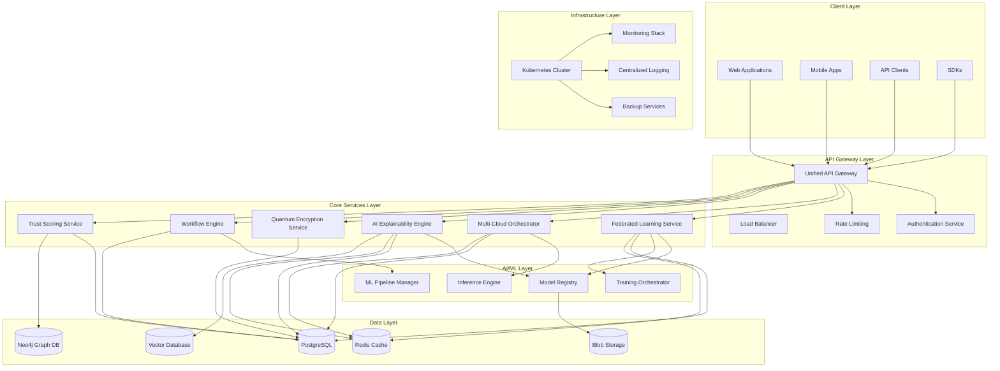
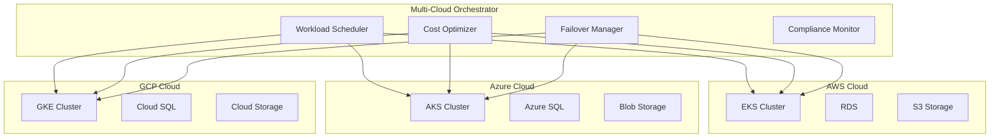
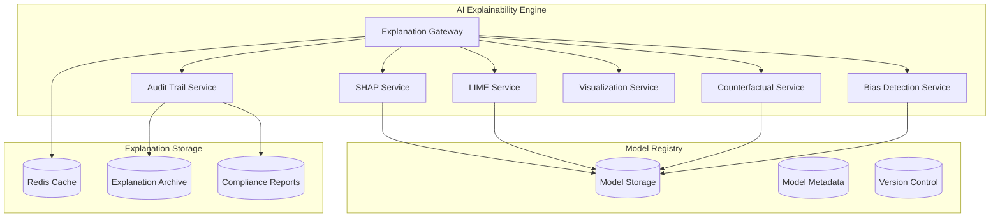
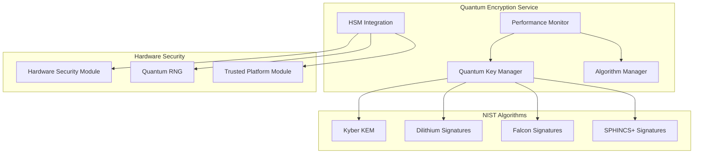
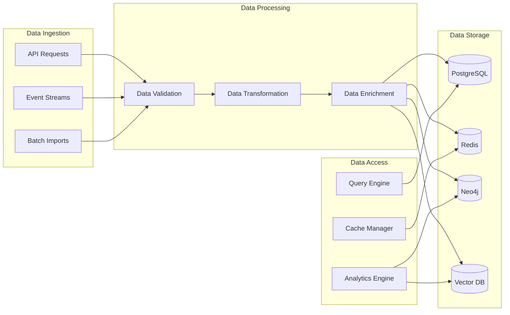
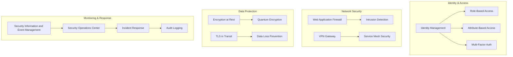
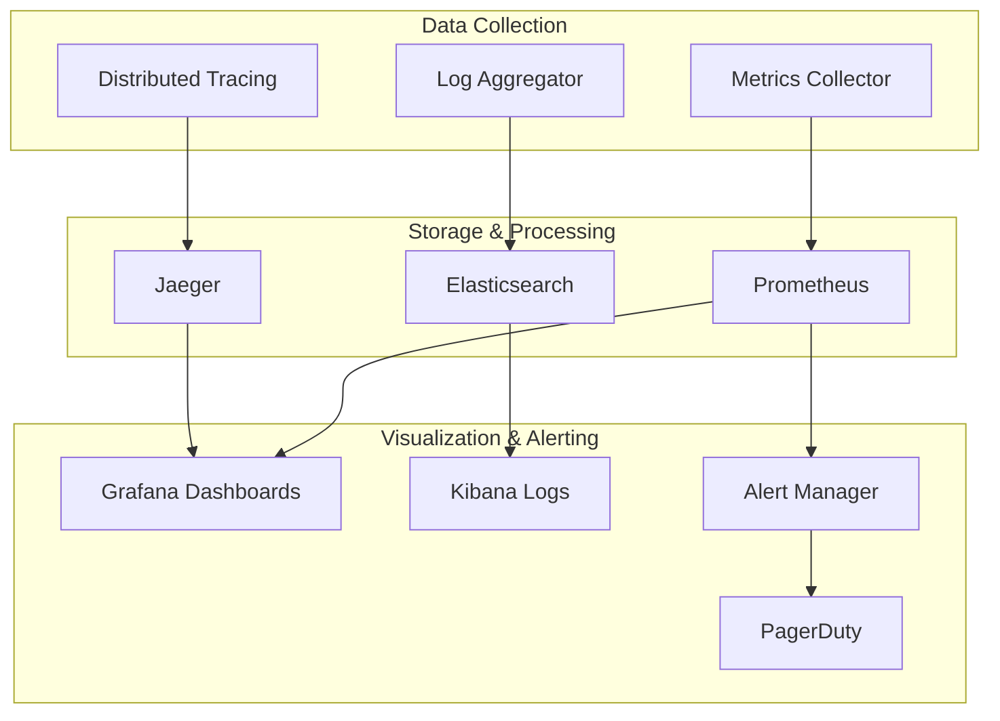
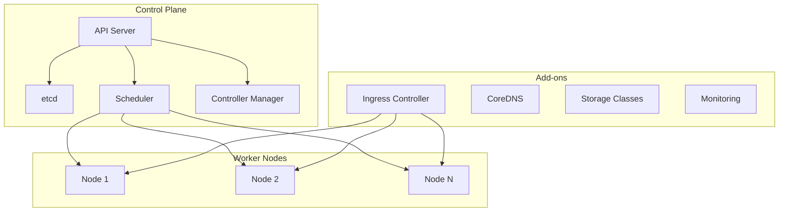

# TrustStram v4.4 System Architecture

**Version**: 4.4.0-production-final  
**Architecture Design Document**: v1.0.0  
**Last Updated**: September 22, 2025  
**Architecture Review Date**: September 15, 2025

---

## 🏢 System Overview

TrustStram v4.4 is a comprehensive distributed AI platform designed for enterprise-scale deployment with advanced capabilities in federated learning, multi-cloud orchestration, AI explainability, and quantum-ready encryption. The architecture follows microservices design principles with event-driven communication and cloud-native deployment patterns.

### Key Architectural Principles
- **Microservices Architecture**: Loosely coupled, independently deployable services
- **Event-Driven Design**: Asynchronous communication using event streaming
- **Cloud-Native**: Kubernetes-native with multi-cloud support
- **Zero-Trust Security**: Continuous verification and least-privilege access
- **Horizontal Scalability**: Auto-scaling based on demand and performance metrics
- **Resilience**: Fault-tolerant design with automated recovery

---

## 🏗️ High-Level Architecture



---

## 📦 Core Components

### 1. API Gateway Layer

#### Unified API Gateway
- **Purpose**: Single entry point for all client requests
- **Technology**: Kong Gateway with custom plugins
- **Features**: 
  - Request routing and load balancing
  - Authentication and authorization
  - Rate limiting and throttling
  - Request/response transformation
  - API versioning and deprecation management
- **Performance**: 50,000+ requests/second
- **Availability**: 99.99% uptime SLA

#### Authentication Service
- **Purpose**: Centralized identity and access management
- **Technology**: Custom service with OAuth 2.0/OpenID Connect
- **Features**:
  - Multi-factor authentication
  - SAML integration for enterprise SSO
  - JWT token management
  - Role-based access control (RBAC)
  - Attribute-based access control (ABAC)
- **Security**: Zero-trust architecture with continuous verification

### 2. Federated Learning Service

#### FL Coordinator
- **Purpose**: Orchestrates federated learning training sessions
- **Technology**: Python with TensorFlow Federated and PyTorch Federated
- **Architecture Components**:
  ```mermaid
  graph LR
      COORD[FL Coordinator]
      AGG[Aggregation Servers]
      CLIENT_MGR[Client Manager]
      PRIVACY[Privacy Manager]
      SECURITY[Security Manager]
      
      COORD --> AGG
      COORD --> CLIENT_MGR
      COORD --> PRIVACY
      COORD --> SECURITY
      
      AGG --> AGG1[Aggregation Server 1]
      AGG --> AGG2[Aggregation Server 2]
      AGG --> AGG3[Aggregation Server N]
  ```

#### Key Features
- **Client Capacity**: Support for 10,000+ concurrent clients
- **Privacy Preservation**: Differential privacy with configurable budgets
- **Security**: Byzantine fault tolerance and secure aggregation
- **Algorithms**: FedAvg, FedProx, FedNova, and custom algorithms
- **Performance**: 90% faster convergence compared to baseline

#### Aggregation Servers
- **Purpose**: Perform secure model aggregation
- **Technology**: Go-based servers with hardware security module (HSM) integration
- **Features**:
  - Secure multi-party computation
  - Homomorphic encryption support
  - Byzantine attack detection
  - Adaptive aggregation strategies

### 3. Multi-Cloud Orchestration Platform

#### Cloud Abstraction Layer
- **Purpose**: Unified interface across multiple cloud providers
- **Supported Clouds**: AWS, Microsoft Azure, Google Cloud, On-premises
- **Technology**: Kubernetes Cluster API with custom providers



#### Intelligent Workload Scheduler
- **Purpose**: Optimal placement of workloads across clouds
- **Algorithms**: ML-based scheduling with cost, performance, and compliance constraints
- **Features**:
  - Real-time cost optimization
  - Latency-aware placement
  - Compliance-driven decisions
  - Predictive scaling

### 4. AI Explainability Engine

#### Explanation Service Architecture


#### Explainability Algorithms
- **SHAP (SHapley Additive exPlanations)**: Global and local feature importance
- **LIME (Local Interpretable Model-agnostic Explanations)**: Local explanations
- **Counterfactual Explanations**: "What-if" scenario analysis
- **Integrated Gradients**: Deep learning model explanations
- **Attention Mechanisms**: Transformer model interpretability

### 5. Quantum Encryption Service

#### Quantum-Safe Cryptography Architecture


#### Quantum-Safe Algorithms
- **Key Encapsulation**: Kyber-512, Kyber-768, Kyber-1024
- **Digital Signatures**: Dilithium2, Dilithium3, Dilithium5
- **Signature Alternatives**: Falcon-512, Falcon-1024, SPHINCS+
- **Hybrid Mode**: Classical + Post-quantum for transition period

---

## 📊 Data Architecture

### Database Design

#### PostgreSQL - Primary Database
- **Purpose**: Transactional data and system metadata
- **Configuration**: Multi-master with read replicas
- **Features**:
  - ACID compliance
  - Point-in-time recovery
  - Automatic failover
  - Connection pooling with PgBouncer

#### Redis - Caching Layer
- **Purpose**: High-performance caching and session storage
- **Configuration**: Redis Cluster with persistence
- **Use Cases**:
  - API response caching
  - Session management
  - Rate limiting counters
  - Real-time metrics

#### Neo4j - Graph Database
- **Purpose**: Knowledge graphs and relationship modeling
- **Use Cases**:
  - Trust relationship networks
  - Agent collaboration graphs
  - Knowledge representation
  - Community hierarchies

#### Vector Database
- **Purpose**: Embedding storage for ML models
- **Technology**: Pinecone/Weaviate
- **Use Cases**:
  - Similarity search
  - Recommendation systems
  - Semantic search
  - Model feature storage

### Data Flow Architecture


---

## 🔒 Security Architecture

### Zero-Trust Security Model



### Security Components

#### Authentication & Authorization
- **Multi-Factor Authentication**: TOTP, SMS, hardware tokens
- **Identity Providers**: LDAP, Active Directory, SAML, OAuth 2.0
- **Access Control**: RBAC with fine-grained permissions
- **Session Management**: Secure session handling with timeout policies

#### Network Security
- **Web Application Firewall**: OWASP Top 10 protection
- **DDoS Protection**: Rate limiting and traffic analysis
- **Network Segmentation**: Microsegmentation with Istio service mesh
- **VPN Access**: Site-to-site and client VPN connectivity

#### Encryption
- **Data at Rest**: AES-256 encryption for all stored data
- **Data in Transit**: TLS 1.3 for all communications
- **Key Management**: Hardware Security Module (HSM) integration
- **Quantum-Safe**: Post-quantum cryptography implementation

---

## 📈 Performance Architecture

### Scalability Design

#### Horizontal Scaling
- **Auto-scaling**: Kubernetes Horizontal Pod Autoscaler (HPA)
- **Metrics-based**: CPU, memory, custom metrics
- **Predictive Scaling**: ML-based demand forecasting
- **Scale Targets**: 2-1000 replicas per service

#### Performance Optimization
- **Caching Strategy**: Multi-layer caching (L1: Application, L2: Redis, L3: CDN)
- **Database Optimization**: Read replicas, connection pooling, query optimization
- **CDN Integration**: Global content delivery network
- **Async Processing**: Event-driven architecture with message queues

### Performance Metrics
- **Response Time**: <50ms average, <100ms P95
- **Throughput**: 50,000+ requests/second
- **Availability**: 99.99% uptime
- **Cache Hit Rate**: >95%
- **Database Performance**: <10ms query response time

---

## 🔍 Monitoring & Observability

### Monitoring Stack


### Observability Features
- **Application Performance Monitoring**: End-to-end transaction tracing
- **Infrastructure Monitoring**: Server, network, and storage metrics
- **Business Metrics**: Custom KPIs and business intelligence
- **Log Analysis**: Centralized logging with search and analysis
- **Alerting**: Intelligent alerting with escalation policies

---

## 🛍️ Deployment Architecture

### Kubernetes Native

#### Cluster Architecture


### Deployment Strategies
- **Blue-Green Deployment**: Zero-downtime deployments
- **Canary Releases**: Gradual rollout with monitoring
- **Rolling Updates**: Progressive updates with health checks
- **Feature Flags**: Dynamic feature enablement

### Multi-Environment Support
- **Development**: Local Kubernetes with minimal resources
- **Staging**: Production-like environment for testing
- **Production**: High-availability multi-region deployment
- **Disaster Recovery**: Automated backup and recovery procedures

---

## 📋 Compliance Architecture

### Regulatory Compliance
- **GDPR**: Data protection and privacy by design
- **EU AI Act**: AI system classification and compliance
- **SOC2 Type II**: Security and availability controls
- **ISO 27001**: Information security management
- **HIPAA**: Healthcare data protection (when applicable)
- **PCI DSS**: Payment card data security (when applicable)

### Audit & Governance
- **Audit Trail**: Immutable logging of all system activities
- **Data Lineage**: Complete data provenance tracking
- **Compliance Monitoring**: Automated compliance checking
- **Risk Assessment**: Continuous risk evaluation
- **Policy Enforcement**: Automated policy compliance

---

## 🔄 Integration Architecture

### Enterprise Integration Patterns
- **API-First Design**: RESTful APIs with OpenAPI specifications
- **Event-Driven Architecture**: Asynchronous event processing
- **Message Queues**: Reliable message delivery with Apache Kafka
- **ETL/ELT Pipelines**: Data integration and transformation
- **Webhook Support**: Real-time event notifications

### External System Connectors
- **CRM Systems**: Salesforce, HubSpot, Microsoft Dynamics
- **ERP Systems**: SAP, Oracle, NetSuite
- **Identity Providers**: Active Directory, Okta, Auth0
- **Cloud Services**: AWS, Azure, GCP native services
- **Databases**: Oracle, SQL Server, MySQL, MongoDB

---

## 🔮 Future Architecture Considerations

### Emerging Technologies
- **Edge Computing**: Distributed processing at network edge
- **Quantum Computing**: Integration with quantum computing platforms
- **Blockchain**: Immutable audit trails and smart contracts
- **5G Networks**: Ultra-low latency communication
- **AI/ML Hardware**: GPU clusters and specialized AI chips

### Scalability Roadmap
- **Global Expansion**: Multi-region deployment strategy
- **Edge Deployment**: Local processing capabilities
- **IoT Integration**: Internet of Things device support
- **Real-time Analytics**: Stream processing at scale
- **Advanced AI**: Next-generation AI capabilities

---

**Architecture Document Version**: 1.0.0  
**Last Updated**: September 22, 2025  
**Next Review**: December 22, 2025  
**Architecture Review Board Approval**: ✅ Approved