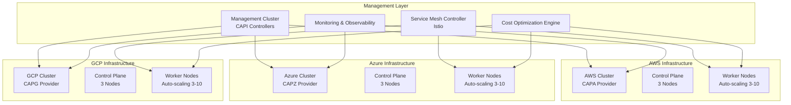

# Multi-Cloud Orchestration Integration Overview

This document provides a comprehensive overview of how the Cluster API (CAPI) providers integrate with TrustStram v4.4's multi-cloud orchestration architecture.

## Architecture Integration

### System Components



## Integration Points

### 1. Cluster API Management

The CAPI providers serve as the foundation for:

- **Infrastructure Provisioning**: Declarative cluster lifecycle management
- **Cloud Abstraction**: Consistent APIs across AWS, Azure, and GCP
- **Automated Operations**: Self-healing and auto-scaling capabilities
- **Compliance**: Built-in security and governance policies

### 2. Service Mesh Integration

```yaml
# Cross-cloud service mesh configuration
apiVersion: networking.istio.io/v1beta1
kind: Gateway
metadata:
  name: multi-cloud-gateway
spec:
  selector:
    istio: eastwestgateway
  servers:
  - port:
      number: 15021
      name: status-port
      protocol: HTTP
    hosts:
    - "*.aws.trustram.local"
    - "*.azure.trustram.local"
    - "*.gcp.trustram.local"
```

Each CAPI-managed cluster automatically receives:
- Istio sidecar injection
- Cross-cluster service discovery
- Encrypted inter-cluster communication
- Traffic management policies

### 3. Cost Optimization Integration

The cost optimization engine leverages CAPI for:

```python
# Cost optimization decision engine
class MultiCloudCostOptimizer:
    def optimize_workload_placement(self, workload_spec):
        # Query CAPI providers for current pricing
        aws_cost = self.capa_provider.get_cost_estimate(workload_spec)
        azure_cost = self.capz_provider.get_cost_estimate(workload_spec)
        gcp_cost = self.capg_provider.get_cost_estimate(workload_spec)
        
        # Select optimal cloud based on cost + performance
        optimal_cloud = self.select_optimal_provider(
            aws_cost, azure_cost, gcp_cost, workload_spec
        )
        
        # Deploy via CAPI
        return self.deploy_workload(optimal_cloud, workload_spec)
```

### 4. Failover System Integration

The automated failover system uses CAPI for:

- **Health Monitoring**: Cluster and node health via CAPI status
- **Rapid Provisioning**: New clusters in alternate regions
- **Traffic Switching**: DNS and load balancer updates
- **Data Synchronization**: Cross-cloud data replication

### 5. Monitoring and Observability

CAPI clusters integrate with the observability stack:

```yaml
# Prometheus monitoring for CAPI clusters
apiVersion: monitoring.coreos.com/v1
kind: ServiceMonitor
metadata:
  name: capi-clusters
spec:
  selector:
    matchLabels:
      cluster.x-k8s.io/provider: cluster-api
  endpoints:
  - port: metrics
    interval: 30s
    path: /metrics
```

## Deployment Workflow

### 1. Initial Setup

```bash
# 1. Setup management cluster
./setup-providers.sh setup

# 2. Validate configurations
./validate-configs.sh

# 3. Deploy workload clusters
./setup-providers.sh deploy
```

### 2. Service Mesh Deployment

```bash
# Install Istio on each cluster
for cluster in aws azure gcp; do
    kubectl --kubeconfig="trustram-${cluster}-cluster-kubeconfig.yaml" \
        apply -f ../../service-mesh/istio/
done
```

### 3. Cost Optimization Activation

```bash
# Deploy cost optimization agents
kubectl apply -f ../../cost-optimization/agents/

# Configure cross-cloud pricing APIs
kubectl apply -f ../../cost-optimization/pricing-configs/
```

### 4. Failover System Setup

```bash
# Deploy circuit breakers and health monitors
kubectl apply -f ../../failover/circuit-breakers/
kubectl apply -f ../../failover/health-monitors/
```

## Configuration Management

### GitOps Integration

CAPI configurations are managed through GitOps:

```yaml
# ArgoCD Application for CAPI
apiVersion: argoproj.io/v1alpha1
kind: Application
metadata:
  name: multi-cloud-capi
spec:
  project: trustram
  source:
    repoURL: https://github.com/trustram/v4.4-configs
    targetRevision: main
    path: cluster-api/providers
  destination:
    server: https://kubernetes.default.svc
    namespace: default
  syncPolicy:
    automated:
      prune: true
      selfHeal: true
```

### Environment Promotion

1. **Development**: Single-node clusters for testing
2. **Staging**: Multi-node clusters with reduced replicas
3. **Production**: Full HA clusters with all optimizations

### Configuration Drift Detection

```bash
# Automated drift detection
kubectl diff -f providers/

# Remediation via ArgoCD
argocd app sync multi-cloud-capi
```

## Security Integration

### Identity and Access Management

- **AWS**: IAM roles and policies via CAPA
- **Azure**: Managed identities via CAPZ
- **GCP**: Service accounts via CAPG
- **Cross-cloud**: Workload Identity Federation

### Network Security

```yaml
# Cross-cloud network policy
apiVersion: networking.k8s.io/v1
kind: NetworkPolicy
metadata:
  name: multi-cloud-policy
spec:
  podSelector:
    matchLabels:
      app: trustram-workload
  policyTypes:
  - Ingress
  - Egress
  ingress:
  - from:
    - namespaceSelector:
        matchLabels:
          cloud-provider: aws
    - namespaceSelector:
        matchLabels:
          cloud-provider: azure
    - namespaceSelector:
        matchLabels:
          cloud-provider: gcp
```

### Secrets Management

CAPI integrates with:
- **AWS Secrets Manager** via AWS provider
- **Azure Key Vault** via Azure provider
- **GCP Secret Manager** via GCP provider
- **HashiCorp Vault** for cross-cloud secrets

## Data Residency Compliance

### Regional Constraints

```yaml
# Data residency enforcement
apiVersion: v1
kind: ConfigMap
metadata:
  name: data-residency-config
data:
  allowed-regions: |
    aws:
      - us-west-2
      - us-east-1
    azure:
      - westus2
      - eastus2
    gcp:
      - us-west1
      - us-central1
  restrictions: |
    gdpr:
      allowed-regions:
        - eu-west-1
        - westeurope
        - europe-west1
    ccpa:
      allowed-regions:
        - us-west-2
        - westus2
        - us-west1
```

### Compliance Automation

CAPI providers automatically enforce:
- **Data sovereignty**: Regional cluster placement
- **Encryption**: At-rest and in-transit encryption
- **Audit logging**: Comprehensive activity logs
- **Access controls**: RBAC and admission controllers

## Performance Optimization

### Cluster Autoscaling

```yaml
# Cluster Autoscaler configuration
apiVersion: apps/v1
kind: Deployment
metadata:
  name: cluster-autoscaler
spec:
  template:
    spec:
      containers:
      - name: cluster-autoscaler
        image: k8s.gcr.io/autoscaling/cluster-autoscaler:v1.28.2
        command:
        - ./cluster-autoscaler
        - --v=4
        - --stderrthreshold=info
        - --cloud-provider=clusterapi
        - --namespace=default
        - --clusterapi-cloud-config-authoritative
        - --node-group-auto-discovery=clusterapi:namespace=default
```

### Resource Optimization

- **Vertical Pod Autoscaler**: Right-size workloads
- **Horizontal Pod Autoscaler**: Scale based on metrics
- **Custom Metrics**: Application-specific scaling
- **Predictive Scaling**: ML-based demand forecasting

## Disaster Recovery Integration

### Backup Strategy

```yaml
# Velero backup across all clusters
apiVersion: velero.io/v1
kind: Schedule
metadata:
  name: multi-cloud-backup
spec:
  schedule: "0 2 * * *"  # Daily at 2 AM
  template:
    storageLocation: multi-cloud-backup
    includedNamespaces:
    - trustram-system
    - production
    ttl: 720h  # 30 days
```

### Recovery Procedures

1. **Automated Failover**: Circuit breakers trigger alternate cloud
2. **Manual Failover**: Operator-initiated cluster switchover
3. **Disaster Recovery**: Full region failure recovery
4. **Data Recovery**: Point-in-time restore capabilities

## Monitoring and Alerting

### CAPI-Specific Metrics

```yaml
# Custom metrics for CAPI clusters
apiVersion: v1
kind: ConfigMap
metadata:
  name: capi-metrics
data:
  queries.yaml: |
    cluster_api_cluster_health:
      query: 'cluster_api_cluster_phase{phase="Provisioned"}'
      description: "Number of provisioned clusters"
    
    cluster_api_machine_health:
      query: 'cluster_api_machine_phase{phase="Running"}'
      description: "Number of running machines"
    
    cluster_api_cost_per_hour:
      query: 'sum by (cloud_provider) (cluster_api_machine_cost_per_hour)'
      description: "Cost per hour by cloud provider"
```

### Alerting Rules

```yaml
# Prometheus alerting for CAPI
apiVersion: monitoring.coreos.com/v1
kind: PrometheusRule
metadata:
  name: capi-alerts
spec:
  groups:
  - name: cluster-api
    rules:
    - alert: ClusterProvisioningFailed
      expr: cluster_api_cluster_phase{phase="Failed"} > 0
      for: 5m
      annotations:
        summary: "Cluster provisioning failed"
        description: "Cluster {{ $labels.cluster_name }} failed to provision"
    
    - alert: HighCostDetected
      expr: cluster_api_cost_per_hour > 100
      for: 15m
      annotations:
        summary: "High cost detected"
        description: "Cluster costs exceed $100/hour"
```

## Testing and Validation

### Automated Testing

```bash
# Comprehensive test suite
./test-multi-cloud.sh --providers=aws,azure,gcp

# Performance testing
./benchmark-clusters.sh --workload=web-app

# Disaster recovery testing
./test-failover.sh --primary=aws --secondary=azure
```

### Validation Checklist

- [ ] All CAPI providers functional
- [ ] Cross-cloud networking established
- [ ] Service mesh connectivity verified
- [ ] Cost optimization active
- [ ] Monitoring and alerting configured
- [ ] Backup and recovery tested
- [ ] Security policies enforced
- [ ] Compliance requirements met

## Troubleshooting Integration Issues

### Common Issues

1. **Cross-cloud Connectivity**
   ```bash
   # Test connectivity between clusters
   kubectl exec -it pod-aws -- curl https://service.azure.cluster.local
   ```

2. **Cost Optimization Not Working**
   ```bash
   # Check cost optimization agents
   kubectl get pods -n cost-optimization
   kubectl logs -n cost-optimization cost-optimizer
   ```

3. **Service Mesh Issues**
   ```bash
   # Validate Istio configuration
   istioctl analyze --all-namespaces
   istioctl proxy-config cluster pod-name
   ```

### Debugging Tools

```bash
# CAPI debugging
kubectl get clusters,machines,machinedeployments -o wide
clusterctl describe cluster trustram-aws-cluster

# Multi-cloud debugging
kubectl get nodes --all-namespaces -o wide
kubectl get services --all-namespaces
```

## Future Enhancements

### Planned Integrations

1. **AI/ML Workload Optimization**: GPU cluster management
2. **Edge Computing**: Extend to edge locations
3. **Serverless Integration**: Function-as-a-Service support
4. **Quantum Computing**: Quantum cloud provider support

### Roadmap

- **Q1 2024**: Enhanced cost optimization algorithms
- **Q2 2024**: Edge computing integration
- **Q3 2024**: Quantum computing pilot
- **Q4 2024**: AI-driven autonomous operations

---

This integration overview demonstrates how TrustStram v4.4's CAPI providers form the foundation of a comprehensive multi-cloud orchestration platform, enabling seamless operation across AWS, Azure, and GCP while maintaining security, compliance, and cost optimization.
